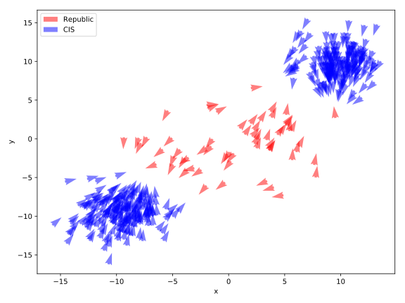

# `battlesim`: Modelling and animating simulated battles between units in Python.

The aim of this side project is to become familiar with Python classes and with primitive forms of animation and simulating environments. We map units onto a 2D plane and run simple simulations that involve them moving towards an enemy unit and attacking it. Rounds finish when one team has completely wiped out the other side, or we have reached the maximum number of timesteps.


The code for the primary engine is found in `battlesim/`, and implementations/examples are found in the Jupyter notebooks. Animations should display properly in these notebooks.

## How to use: The Basics

Firstly, check the requirements for using this simulator, of which most come with the **Anaconda** distribution. In addition you will need the **ffmpeg** video conversion package to generate the simulations as animations.

Secondly, you will need to import the package as:

```python
import battlesim as bsm
```

We recommend using `bsm` as a shorthand to reduce the amount of writing out you have to do. If you're using Jupyter notebook we also recommend:

```python
import matplotlib.pyplot as plt
plt.rcParams["animation.html"] = "html5"
%matplotlib inline
```

The second line is important when you come to plotting the animations, as there are a number of issues with using it. Unfortunately it's not simple to just import a `Unit`, as you must do so within a *context manager* of a `Battle`:

```python
with bsm.Battle("datasets/starwars_clonewars.csv") as b:
	u = bsm.Unit(b, "Clone Trooper")
```

The unit type `utype` parameter can be left, in which case by default the first row found in the `.csv` file will be selected as that unit. Unfortunately the `Battle` object must be passed to every constructor of `Unit` and `Army`, since it requires this information to
populate itself.

What about if we wish to create more than one unit?

```python
with bsm.Battle("datasets/starwars_clonewars.csv") as b:
	a = bsm.Army(b, "Clone Trooper", 20)
	print(a)

>>> Army(type='Clone Trooper', n='20')
```

Here we specify that we want to create 20 clone troopers for a formation. `Army` has a number of useful functions for allocating positions to all of the units, suggesting which *AI* algorithm they should use in choosing targets, moving, etc.

## How to use: Simulation

Once you've created a group of `Army` or `Unit` objects and you want to pit them against each other, you should group them all into a `list` object then pass them to a `simulate_` function:

```python
with bsm.Battle("datasets/starwars_clonewars.csv") as b:
	# trial must be a list of Army
	trial = [
		bsm.Army(b, "B1 battledroid", 100).set_loc_gaussian([10., 10.], [1., 1.]),
		bsm.Army(b, "Clone Trooper", 30).set_loc_gaussian([0., 0.], [1., 1.])
	]
	sim1 = bsm.simulate_battle(trial, max_timestep=500)
```

By default, the simulation function will make a record of important parameters at each step and then return these parameters as a `pandas.DataFrame` at the end in *long form*. In addition, because you want to see what's going on - we can animate the frames using one of the functions in `simplot.py` (example below using Jupyter notebook):

```python
from IPython.display import HTML
HTML(bsm.quiver_fight(sim1).to_jshtml())
```

Here `quiver_fight` treats each `Unit` object as a quiver arrow in 2-d space (position and direction facing it's enemy). The targets should move towards each other and attempt to kill each other. Dead units are represented as crosses **'x'** on the map. 



The rest is for you to explore, tweak and enjoy watching arrows move towards each other and kill each other.

## Engine specifics: Coming up with `Unit`

Units are provided in a file named `unit-scores.csv`, which provides the Name, Allegiance, HP (hit points) and other characteristics about each of the units. Each named unit can then be created as a `Unit` object (`unit.py`), which in turn belongs in a group of Units known as an `Army` (found in `army.py`). Battles are created using a unit file in `battle.py`. Simulations are called using one of the functions found in `simulator.py`, and the results can then be plotted using one of the plotting functions in `simplot.py`, alternatively you can write code to plot it yourself.

| Name | Allegiance | HP | Damage | ... | Accuracy |
| ------------- | ---------- | ---- | ---- | --- | ---- |
| B1 battledroid | CIS | 20 | 15 | ... | 30 |
| Clone Trooper | Republic | 50 | 16 | ... | 60 |
| Clone Commando | Republic | 120 | 20 | ... | 97 |
| Droideka | CIS | 20 | 20 | ... | 40 |

The example above, is some basic stats about Star Wars units as an illustration. This work is very much still in the earliest stages and may be subject to large changes in the future.

***

Ensure that any use of this material is appropriately referenced and in compliance with the license.